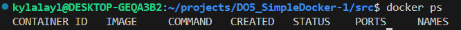
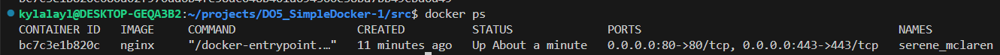

## Part 1. Готовый докер

Возьмем официальный докер-образ с nginx и выкачаем его при помощи `docker pull`.

>Скачивание образа

Проверим наличие докер-образа через `docker images`.

>Проверка наличия докер-образа

Запустим докер-образ через `docker run -d [image_id|repository]`.

>Запуск докер-образа

Проверим, что образ запустился через `docker ps`.

>Проверка запуска

Посмотрим информацию о контейнере через `docker inspect [container_id|container_name]`. По выводу команды определим:
- размер контейнера = 81920. `SizeRootFs`: общий размер всех файлов в контейнере в байтах. `SizeRw`: размер файлов, которые были созданы или изменены в контейнере, по сравнению с его изображением, в байтах

- список замапленных портов = 0.

- ip контейнера = 172.17.0.2

Остановим докер контейнер через `docker stop [container_id|container_name]`.

>Остановка докера

Проверим, что контейнер остановился через `docker ps`.

>Проверка остановки

Запустим докер с портами `80` и `443` в контейнере, замапленными на такие же порты на локальной машине, через команду `run`.

>Проверка остановки

Проверим, что в браузере по адресу `localhost:80` доступна стартовая страница `nginx`.

>Страница `localhost:80`

Перезапустим докер контейнер через `docker restart [container_id|container_name]`.

>Перезапуск докер контейнера

Проверим любым способом, что контейнер запустился.

>Выполнение команды `docker ps`

>Страница `localhost:80`

## Part 2. Операции с контейнером

Прочитаем конфигурационный файл `nginx.conf` внутри докер контейнера через команду `exec`.

>Прочитаем файл `nginx.conf`

Создадим на локальной машине файл `nginx.conf`. Настроим в нем по пути `/status` отдачу страницы статуса сервера `nginx`. Закомментируем строку `#include /etc/nginx/conf.d/*.conf;` и добавим блок `server`, в которой укажем путь `/status`

>Создадим файл

Скопируем созданный файл `nginx.conf` внутрь докер-образа через команду `docker cp`.

>Скопируем созданный файл

Перезапустим `nginx` внутри докер-образа через команду `exec`.

>Перезапустим `nginx`

Проверим, что по адресу `localhost:80/status` отдается страничка со статусом сервера `nginx`.

>`localhost:80/status`

Экспортируем контейнер в файл `container.tar` через команду `export`.

>Экспортируем контейнер в файл `container.tar`

Остановим контейнер.

>Остановка

Удалим образ через `docker rmi [image_id|repository]`, не удаляя перед этим контейнеры.

>Удаление образа, не удаляя перед этим контейнеры

Удалим остановленный контейнер.

>Удаление контейнера

Импортируем контейнер обратно через команду `import`.

>Импорт контейнера

Запустим импортированный контейнер.

>Запуск

Проверим, что по адресу `localhost:80/status` отдается страничка со статусом сервера `nginx`.

>`localhost:80/status`

## Part 3. Мини веб-сервер

Напишем мини-сервер на `C` и `FastCgi`, который будет возвращать простейшую страничку с надписью `Hello World!`.

>Код мини-сервера

Запустим написанный мини-сервер через `spawn-fcgi` на порту `8080`.

>Запуск мини-сервера 

Напишем свой nginx.conf, который будет проксировать все запросы с `81` порта на `127.0.0.1:8080`.

>Указание порта и IP в nginx.conf

Проверим, что в браузере по `localhost:81` отдается написанная тобой страничка.

>`localhost:81`

Но для того, чтобы запустить мини-сервер, я приложила немного больше усилий. Изначально я скачала докер образ через `docker pull nginx` и запустила контейнер с портом 81

>Скачивание и запуск докер-образа

Скопировала созданные файлы в контейнер с помощью `docker cp`

>Скопировала созданные файлы

Зашла в контейнер с использованием оболочки bash и обновила систему с помощью `apt-get upadte`

>Обновление системы

Скомпилировала наш мини-сервер 

>Компиляция мини-сервера

Запустила написанный мини-сервер через `spawn-fcgi` на порту `8080`

>Запуск мини-сервера

И затем уже открывается страница `localhost:81`, скриншот которой выше.

## Part 4. Свой докер

Напишем свой докер-образ, который:

1) собирает исходники мини сервера на FastCgi из Части 3;

2) запускает его на 8080 порту;

3) копирует внутрь образа написанный ./nginx/nginx.conf;

4) запускает nginx.

>Код докер-образа

Соберем написанный докер-образ через `docker build` при этом указав имя и тег. 

- Флаг `-t` позволяет назначить тег созданному образу для удобного обращения и версиирования.

>Сборка докер-образа

>Успешное завершение сборки докер-образа

Проверим через `docker images`, что все собралось корректно.

>Демонстрация `docker images`

Запустим собранный докер-образ с маппингом `81` порта на `80` на локальной машине и маппингом папки `./nginx` внутрь контейнера по адресу, где лежат конфигурационные файлы nginx'а. 

- `-i` — Этот флаг означает, что Docker будет работать в интерактивном режиме. Он сохраняет открытым стандартный ввод контейнера. Обычно используется совместно с флагом -t для работы с терминалом.

- `-t` — Этот флаг создаёт псевдотерминал (TTY) для контейнера. В сочетании с -i делает возможной работу с терминалом внутри контейнера. Это нужно для того, чтобы контейнер был доступен через консольный интерфейс, например, для ручного ввода команд.

- `-d` — (фоновый режим) Запускает контейнер в фоновом режиме, то есть он продолжает работать в фоне, а не блокирует терминал.

>Запуск

Проверим, что по `localhost:80` доступна страничка написанного мини сервера.

>`localhost:80`

Допишем в `./nginx/nginx.conf` проксирование странички `/status`, по которой надо отдавать статус сервера `nginx`.

>Переписывание `nginx.conf`

Перезапустим докер-образ.

>Перезапуск

Проверим, что теперь по `localhost:80/status` отдается страничка со статусом `nginx`

>`localhost:80/status`

## Part 5. Dockle

Установим Dockle с помощью ввода в терминал

> `VERSION=$(
 curl --silent "https://api.github.com/repos/goodwithtech/dockle/releases/latest" | \
 grep '"tag_name":' | \
 sed -E 's/.*"v([^"]+)".*/\1/' \
) && curl -L -o dockle.deb https://github.com/goodwithtech/dockle/releases/download/v${VERSION}/dockle_${VERSION}_Linux-64bit.deb`

А затем 

> sudo dpkg -i dockle.deb && rm dockle.deb

Просканируем образ из предыдущего задания через `dockle [image_id|repository]`.

>Образ из прошлого задания

Чтобы решить конфликты, необходимо очищать кэш apt-get и создать пользователя для контейнера.

>Новый докер-образ

Теперь снова запустим Dockle для проверки. 

>Демонстрация исправленных конфликтов

> Ошибка CIS-DI-0010 связана с тем, что последня версия nginx не рекомендует хранить ключи и другие конфиденциальные данные в контейнере, так как это может привести к утечкам. Данная проблема у меня не решилась с помощью применения ключей -ak при запуске команды Dockle, а так же не решилась с перемещением ключей из контейнера, поэтому я запускала Dockle c игнорированием данной ошибки

## Part 6. Базовый Docker Compose

Напишем файл `docker-compose.yml`, с помощью которого:

1) Поднимем докер-контейнер из Части 5 (он должен работать в локальной сети, т. е. не нужно использовать инструкцию EXPOSE и мапить порты на локальную машину).

2) Поднимем докер-контейнер с nginx, который будет проксировать все запросы с 8080 порта на 81 порт первого контейнера.

3) Замапим 8080 порт второго контейнера на 80 порт локальной машины.

>Маппинг решила добавить сразу в `docker-compose`

>Файл `docker-compose`

Остановим все запущенные контейнеры.

>Файл `docker-compose`

Соберем и запустим проект с помощью команд `docker-compose build` и `docker-compose up`.

>Команда `docker-compose`

Проверим, что в браузере по `localhost:80` отдается написанная страничка, как и ранее.

>Команда `docker-compose`

